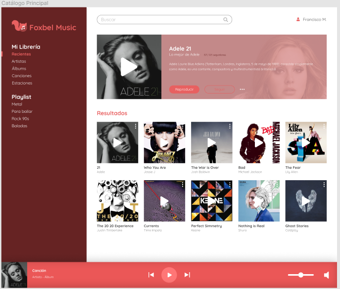
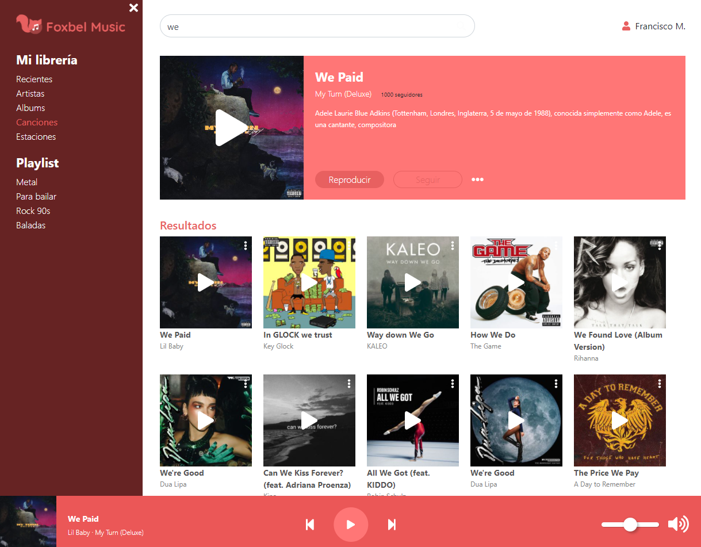

# Foxbel Music 🎵

Explore and enjoy the top songs from [deezer](https://www.deezer.com/mx/).

# Motivation

Frontend challenge

# Screenshots

## Wireframe
 

## Result
 


# Features

* Play or pause song
* Go to next or previous song
* Fetch top songs from the [deezer](https://www.deezer.com/mx/) api
* Explore the top songs

# Tools

* [React](https://en.reactjs.org/) - Framework
* [Typescript](https://www.typescriptlang.org/) - Superset of javascript
* [Rxjs](https://rxjs.dev/) - Like lodash for events
* [SASS](https://sass-lang.com/) - CSS preprocessor
* [Fontawesome](https://fontawesome.com/) - Icons
* [Music provider](https://www.deezer.com/mx/) - Api to get songssts
* [Lodash](https://lodash.com/) - Javascript utilities
* [Bootstrap](https://getbootstrap.com/) - UI Components
* [Axios](https://github.com/axios/axioshttps://github.com/axios/axios) - For HTTP requests
* [SWR](https://swr.vercel.app/) - Data fetching & caching with axios

# Deployment

[Vercel](https://foxbel-music-nine.vercel.app/) 


# To run this app
1. Clone this repo
2. Run ```npm install```
3. Run ```npm start```

